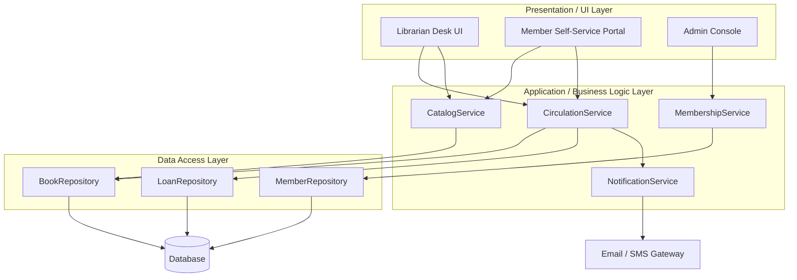

# 2. System Architecture

The system follows a classic layered (n-tier) architecture. Separating layers keeps each part focused on a single responsibility: the UI only handles presentation, the business logic layer enforces library policy, and the data access layer isolates persistence details from everything above it.

## 2.1 Layers

- **Presentation / UI Layer** - the interface librarians, members, and administrators use: a desk application or web UI for search, checkout, and reporting screens.
- **Application / Business Logic Layer** - the core services that implement use cases: `CatalogService`, `CirculationService` (issue/return/renew), `MembershipService`, and `NotificationService`. This is where borrowing rules, fine calculations, and policy checks live.
- **Data Access Layer** - repositories (`BookRepository`, `MemberRepository`, `LoanRepository`) that translate between in-memory objects and persistent storage, hiding SQL/ORM details from the business layer.
- **Data Layer** - the actual persistent store (relational database in most real deployments).
- **Notification Subsystem** - a supporting component invoked by the business layer to send due-date/overdue messages; can be swapped out (email, SMS, push) without changing circulation logic.

## 2.2 Component Diagram

## 2.3 Interaction Notes

Requests always flow downward: the UI layer never talks to the data access layer directly, and the data access layer never calls back up into business logic. This one-directional dependency is what allows, for example, the persistence technology to be swapped (files to a real database) without changing `CirculationService` or any UI code. The `NotificationService` is deliberately decoupled from `CirculationService` through an Observer-style relationship (see [06-state-diagram.md](06-state-diagram.md) and the companion [implementation repo](https://github.com/RamahB0/library-management-system-ood)), so circulation logic does not need to know how members are actually notified.
