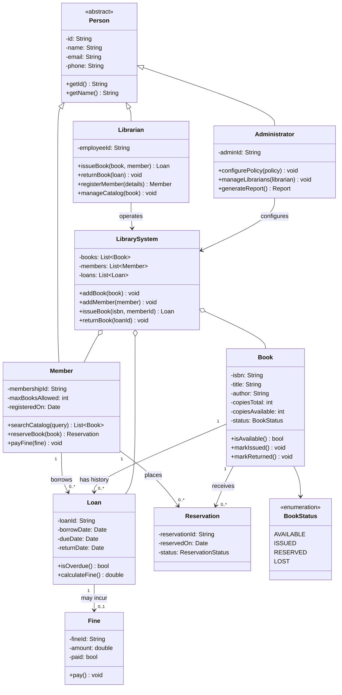

# 3. Class Diagram

This is the core structural model of the Object-Oriented Analysis: the classes derived from the actors and use cases in [01-requirement-analysis.md](01-requirement-analysis.md), with their attributes, methods, and relationships. Each class is designed around a single responsibility - `Book` only knows about its own catalog data and status, `Loan` only knows about one borrowing event, and `LibrarySystem` coordinates them without duplicating their internal state.

## 3.1 Diagram

## 3.2 Design Notes

- `Person` is abstract and holds only what every actor-as-object has in common (identity/contact info); `Member`, `Librarian`, and `Administrator` extend it with role-specific data and behavior, mirroring the inheritance approach used for `User`/`Student`/`Teacher` in the companion implementation repo.
- `Book` is deliberately unaware of `Loan` or `Member` details beyond its own `status` - it only exposes `isAvailable()`, `markIssued()`, and `markReturned()`. This keeps the state transitions in [06-state-diagram.md](06-state-diagram.md) self-contained inside `Book`.
- `Loan` is a first-class object (not just a foreign-key pair) because it carries its own behavior (`isOverdue()`, `calculateFine()`) and its own lifecycle independent of `Book` or `Member`.
- `LibrarySystem` is the only class that is aware of all the others; it plays the coordinating role that a Singleton `LibrarySystem`/facade plays in the implementation repo.
