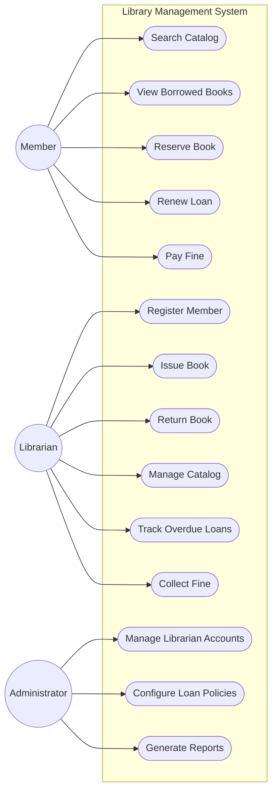
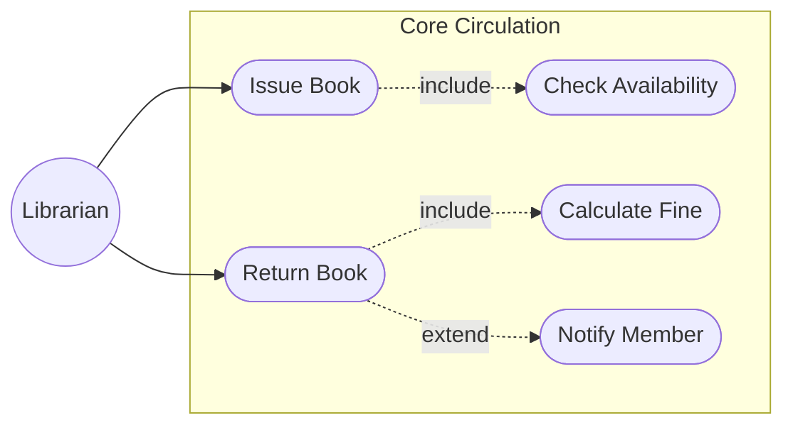

# 4. Use Case Diagrams

Mermaid (the diagramming syntax GitHub renders inline) does not provide a dedicated UML use-case diagram type, so the diagrams below use its flowchart notation to represent the same information: actors as round nodes outside a system boundary, use cases as stadium-shaped nodes inside it, and plain arrows for "actor performs use case" associations. Dotted arrows are used for `include`/`extend` relationships between use cases, per standard UML convention.

## 4.1 System-Wide Use Case Diagram

## 4.2 Focused Use Case Diagram - Core Circulation

This second diagram zooms into the two use cases that are elaborated further as sequence diagrams in [05-sequence-diagrams.md](05-sequence-diagrams.md): **Issue Book** and **Return Book**. It shows their `include`/`extend` relationships with supporting use cases.

## 4.3 Notes

- **include** means the base use case always triggers the included one (issuing a book always includes checking availability first).
- **extend** means the extending use case only runs conditionally (a member is only notified if the returned book was overdue, i.e. `CalcFine` produced a non-zero fine).
