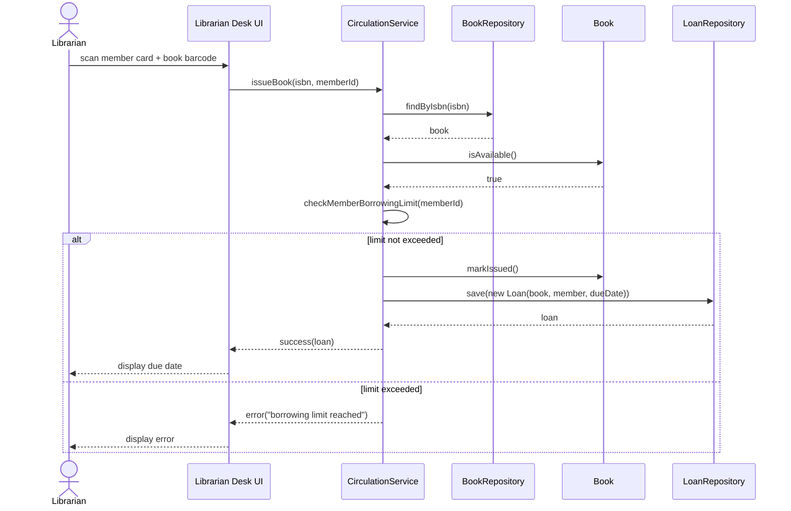
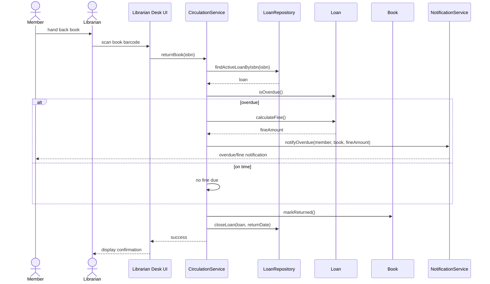

# 5. Sequence Diagrams

Per the assignment, this document details two use cases as sequence diagrams: **Issue Book** and **Return Book**. These were chosen because together they form the core circulation workflow that every other use case (reservations, fines, overdue tracking) builds on.

## 5.1 Issue Book

## 5.2 Return Book

## 5.3 Notes

Both diagrams show `CirculationService` as the orchestrator: it is the only object that talks to `BookRepository`, `LoanRepository`, and `NotificationService` directly, which matches the layered architecture in [02-architecture.md](02-architecture.md) and keeps `Book`/`Loan` focused purely on their own state and calculations rather than coordination logic.
