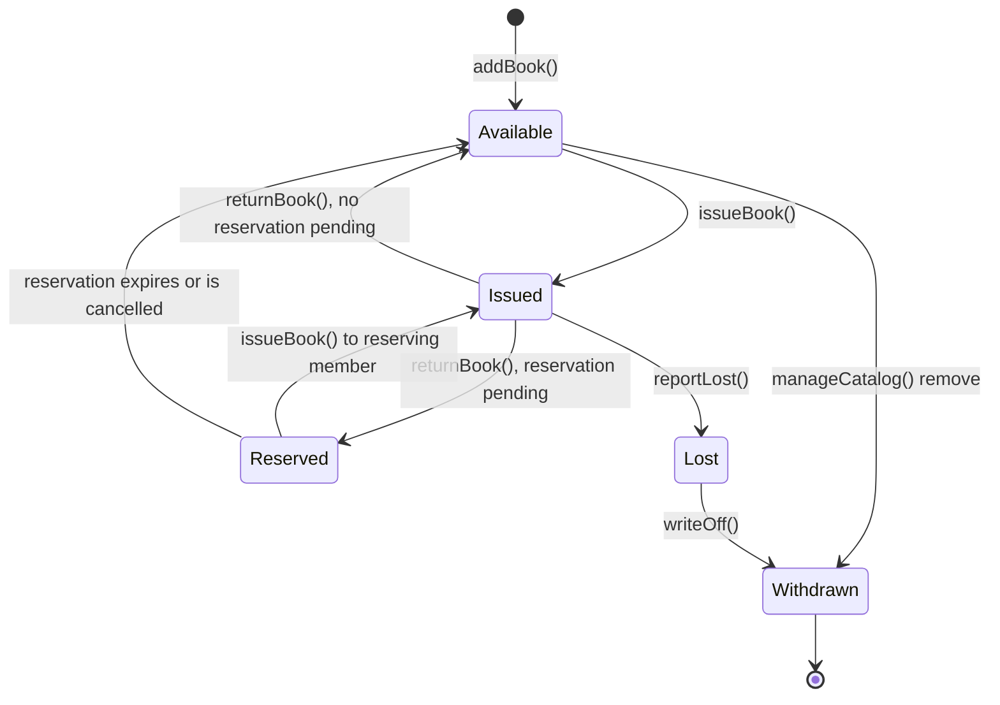

# 6. State Diagram - Book

This models how a single `Book` object's `status` changes over its lifetime in the catalog, driven by the events defined on `Book` and `CirculationService` in [03-class-diagram.md](03-class-diagram.md).

## 6.1 Diagram

## 6.2 State Descriptions

| State | Meaning | Allowed next events |
|---|---|---|
| Available | On the shelf, can be issued or reserved-in-advance is not needed since it is free | `issueBook()`, `manageCatalog()` (remove) |
| Issued | Currently on loan to a member | `returnBook()`, `reportLost()` |
| Reserved | Just returned, but held for a member with an active reservation | `issueBook()` (to the reserving member), reservation expiry |
| Lost | Reported lost/damaged while on loan | `writeOff()` |
| Withdrawn | Permanently removed from the catalog (final state) | none |

## 6.3 Note on "Returned" as a Transition, Not a State

The assignment's example lifecycle is `Available -> Issued -> Returned`. In this model, "returned" is intentionally modeled as the **transition** `returnBook()` rather than as a state the book rests in, because the moment a book is returned it must immediately become either `Available` or `Reserved` (if another member is waiting) - it never sits in a distinct "Returned" state that a librarian would see on a shelf report. This is a small but deliberate refinement made during OOA: state diagrams should reflect states an object can be *observed in*, not just event names.
