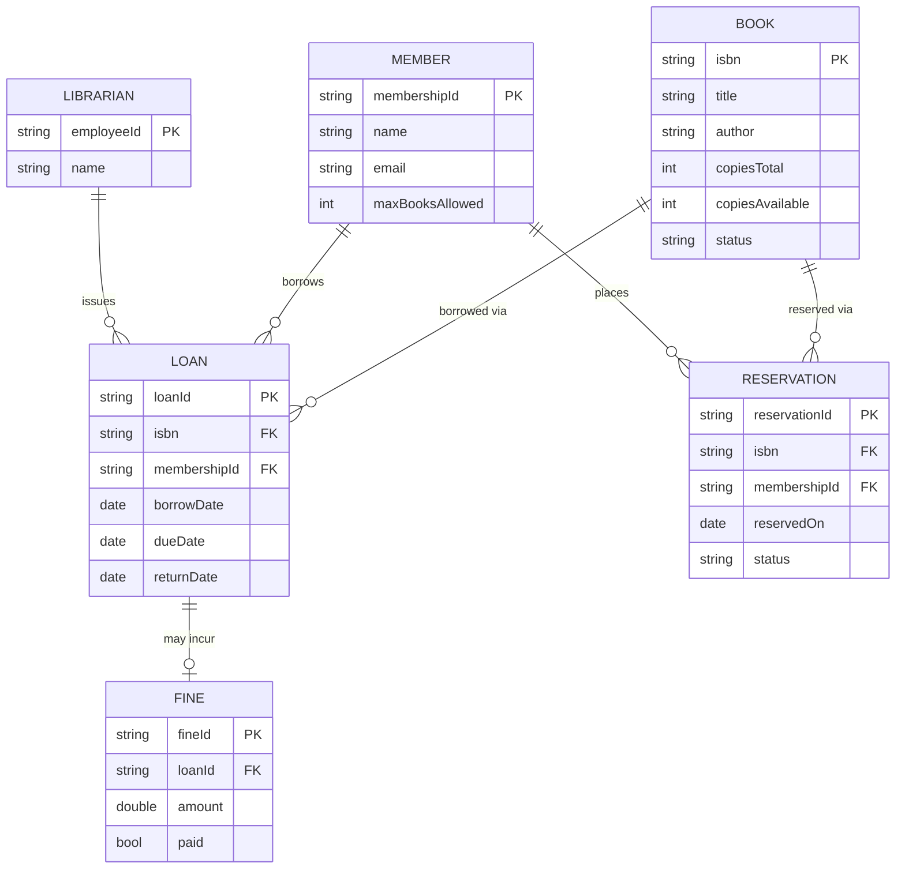
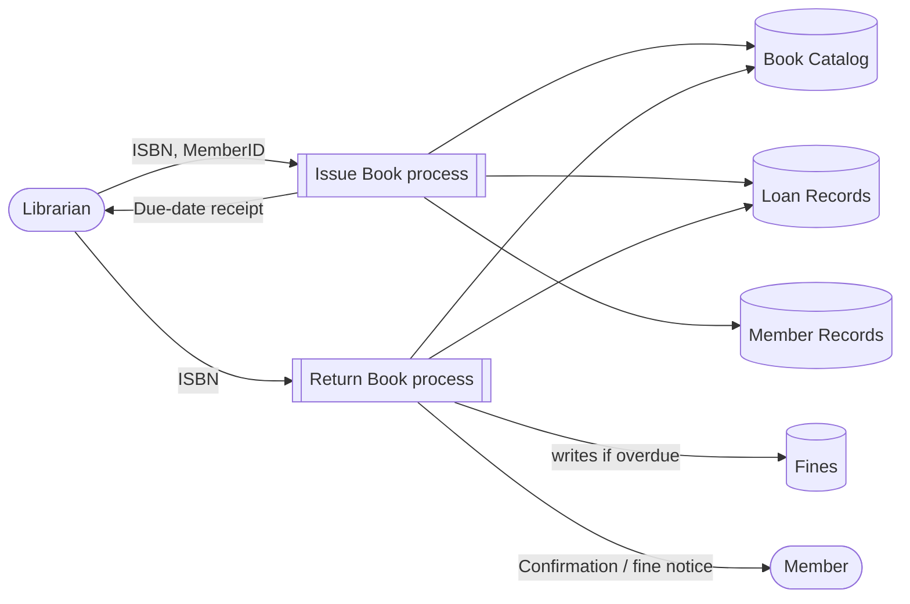
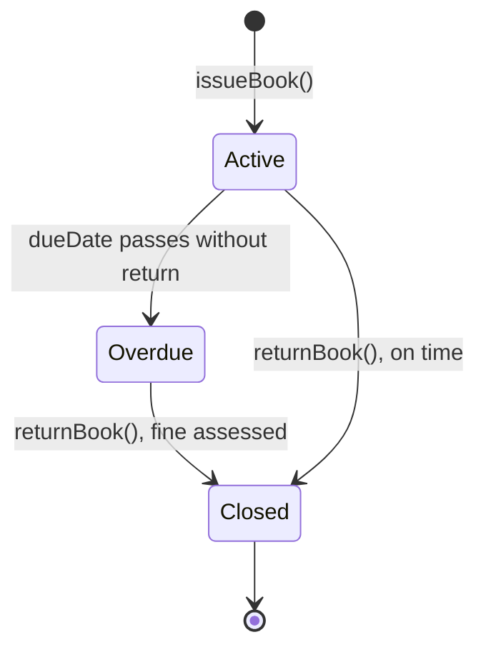

# 7. Data, Functional, and Behavioral Models

These three views complement the object-oriented models in the previous documents by looking at the system from three different angles: what data it manages (data model), what it does (functional model), and how it behaves over time (behavioral model).

## 7.1 Data Model

The data model captures persistent entities and their relationships, independent of any particular class's methods - this is what the Data Access Layer in [02-architecture.md](02-architecture.md) ultimately persists.

## 7.2 Functional Model

The functional model describes *what* the system computes, independent of timing or object structure - essentially a data-flow view of the two core processes from [05-sequence-diagrams.md](05-sequence-diagrams.md).

Each process box corresponds directly to a `CirculationService` method (`issueBook`, `returnBook`), and each data store corresponds to a repository from the architecture document - the functional model and the architecture are two views of the same system.

## 7.3 Behavioral Model

The behavioral model describes how the system reacts to events over time. [06-state-diagram.md](06-state-diagram.md) covers the `Book` lifecycle in detail; the table below extends that view to system-level triggers that are not tied to a single object's state alone.

| Trigger / Event | System Reaction | Resulting Change |
|---|---|---|
| Due date passes without a return | Loan is flagged overdue; a daily fine begins accruing | `Loan.isOverdue()` becomes true; `NotificationService` alerts the member |
| A reservation is placed on a currently-issued book | Reservation is queued | `Book` will transition to `Reserved` (not `Available`) on its next return |
| Member reaches their borrowing limit | Further `issueBook()` calls for that member are rejected | No state change to `Book`; `CirculationService` returns an error |
| Book is reported lost while issued | Loan is closed administratively with an assessed replacement fee | `Book` transitions to `Lost` (see state diagram) |
| Administrator changes the loan-policy fine rate | Future fine calculations use the new rate; existing fines are unaffected | `Loan.calculateFine()` reads the current policy at return time |

### Supporting state view - Loan lifecycle

Because loans have their own behavior over time (separate from the book they reference), it is useful to show their lifecycle too:

